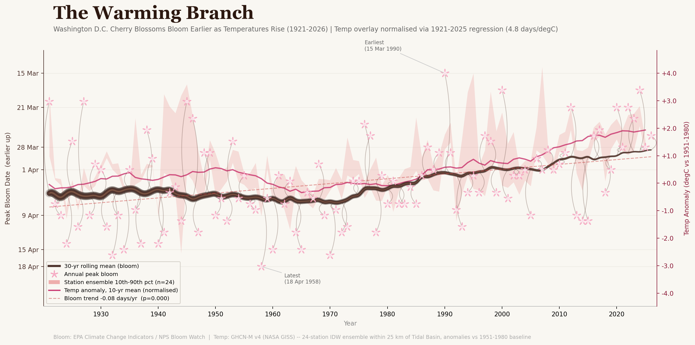

# The Warming Branch: D.C. Cherry Blossoms and the Pollinator Timing Problem



Washington D.C.'s Yoshino cherry trees have been blooming roughly **9 days earlier** than they did a century ago — and the shift is accelerating. This repository documents that trend across a 106-year record (1921–2026), overlays it against local temperature data from a 24-station ensemble surrounding the Tidal Basin, and visualizes the result as an editorial figure designed for Earth Day outreach about the risks this timing shift poses to pollinators.

The project was originally prepared as background analysis for an Earth Day informational newsletter on pollinator health.

---

## Project Intent

Spring-blooming plants and the insects that pollinate them have co-evolved over millennia to be active at the same time. That synchrony is increasingly at risk. Cherry trees respond to warming winters by flowering earlier; many native bees and other pollinators rely on different cues — day length, soil temperature — that haven't shifted as fast. When flowers and pollinators fall out of step, both lose.

The Yoshino cherries at the Tidal Basin are among the most carefully documented flowering plants in the world. Their century-long bloom record makes them an unusually clear window onto this broader problem.

This analysis does three things:

1. **Assembles the longest available bloom record** for the Tidal Basin site by merging two primary sources: the EPA Climate Change Indicators dataset (1921–2016) and NPS Bloom Watch (2004–2026).
2. **Pairs that record with local temperature data** — not global averages — using a 24-station GHCN-M v4 ensemble with inverse-distance weighting, anchored to the Tidal Basin site.
3. **Produces a publication-quality figure** ("The Warming Branch") designed to communicate the trend clearly to a general audience, alongside a validation map of the temperature station network.

---

## Repository Structure

```
dc-cherry-blossom-analysis/
│
├── pollinator_analysis.ipynb       # Main analysis notebook (8 cells, fully executable)
├── make_station_map.py             # Standalone script to regenerate the station map
├── cherry-blossoms_fig-1.csv       # EPA Climate Change Indicators source data (1921–2016)
├── sakura-branch.jpg               # Reference photo used for figure design
├── gemini_figureplan.md            # Figure design specification
│
├── data/
│   ├── nps_bloom_watch.csv         # NPS Bloom Watch peak bloom dates (2004–2026)
│   ├── ghcnm_station_meta.csv      # Metadata for the 24 GHCN-M v4 stations (lat, lon, distance)
│   ├── ghcnm_station_annual.csv    # Per-station annual mean TAVG (°C), wide format
│   └── local_temp_ensemble.csv     # IDW ensemble mean anomaly by year (final temperature series)
│
└── output/
    ├── dc_bloom_vs_temp_1921_2026.png   # "The Warming Branch" — main figure
    └── station_map.png                  # Validation map of GHCN-M v4 station network
```

### Notebook cells

| Cell | Type | Content |
|------|------|---------|
| 0 | Markdown | Project introduction (newsletter copy) |
| 1 | Code | Load EPA bloom data from `cherry-blossoms_fig-1.csv` |
| 2 | Code | Load NPS Bloom Watch data; merge with EPA series; log decisions |
| 3 | Code | Download GHCN-M v4 tarball; find stations within 25 km; compute IDW ensemble |
| 4 | Code | Merge bloom + temperature; OLS regression; rolling means; normalization params |
| 5 | Code | "The Warming Branch" figure |
| 6 | Markdown | Station ensemble description and methodology |
| 7 | Code | Station validation map |

---

## Data Sources

### Bloom dates
| Source | Years | Notes |
|--------|-------|-------|
| [EPA Climate Change Indicators](https://www.epa.gov/climate-indicators) | 1921–2016 | Original CSV in repo root; units: Day of Year |
| [NPS Bloom Watch](https://www.nps.gov/subjects/cherryblossom/bloom-watch.htm) | 2004–2026 | Static CSV in `data/`; retrieved 2026-04-11 |

**Merge rule:** Overlap years 2004–2016 use the mean of both sources when they disagree (sole conflict: 2008, EPA=89, NPS=86 → 87.5). NPS-only years 2017–2026 are appended directly.

### Temperature
**GHCN-M v4 QCF** (NOAA/NCEI), accessed via:
```
https://www.ncei.noaa.gov/pub/data/ghcn/v4/ghcnm.tavg.latest.qcf.tar.gz
```
Downloaded at runtime by Cell 3; cached locally in `data/`. 24 stations within 25 km of the Tidal Basin (38.889°N, 77.037°W) are selected from the full inventory.

**Ensemble construction:**
- Annual mean TAVG computed from monthly values with ≥ 8 valid months
- Per-station anomalies relative to each station's 1951–1980 baseline (minimum 15 years required)
- IDW weights: *w* = 1/*d*² where *d* is distance in km from the Tidal Basin
- Ensemble mean at each year weighted across all stations with valid anomalies that year

**Temperature overlay normalization:** The temperature anomaly series is mapped onto the bloom DOY axis via OLS regression of DOY ~ Anomaly across the overlap record (~4.8 days/°C). This lets both series share the same inverted y-axis, so warming temperatures and earlier bloom dates both trend upward in the figure.

---

## Reproducing the Analysis

**Requirements:** Python 3.9+, with the following packages:

```
pandas numpy matplotlib scipy geopandas contextily shapely
```

The notebook was developed using the `prop13_paper` project virtual environment. To run it in a fresh environment:

```bash
pip install pandas numpy matplotlib scipy geopandas contextily shapely
jupyter notebook pollinator_analysis.ipynb
```

Cell 3 downloads the GHCN-M v4 tarball (~25 MB) on first run and caches the extracted data files in `data/`. Subsequent runs skip the download if the cache files exist.

To regenerate the station map independently:

```bash
python make_station_map.py
```

---

## Key Findings

- **Trend:** −0.08 days/year advance in peak bloom since 1921 (p < 0.001, N = 106)
- **Total shift:** ~8.8 days earlier over the full 1921–2026 record
- **Period means:** DOY 95.3 (≈ April 5) in 1921–1940 vs. DOY 88.7 (≈ March 29) in 1997–2026
- **Extremes:** Earliest bloom March 15, 1990 (DOY 74); latest April 18, 1958 (DOY 108)
- **Interannual variability is large** (R² = 0.12) — year-to-year weather still dominates individual years, but the long-run direction is unambiguous

---

## License

Data files are derived from public-domain U.S. government sources (EPA, NPS, NOAA/NCEI). Code and figures are released under the [MIT License](https://opensource.org/licenses/MIT).
